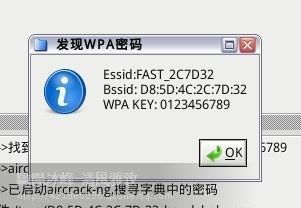

# 输出

## 1. 普通的输出

- 生活中的“输出”

  

  

- 软件中的“输出”

  

- python中变量的输出

```
# 打印提示
print('hello world')
print('萨瓦迪卡---泰语，你好的意思')
```

## 2. 格式化输出

### <1>格式化操作的目的

比如有以下代码:

```
pirnt("我今年10岁")
pirnt("我今年11岁")
pirnt("我今年12岁")
    ...
```

- 想一想:

  > 在输出年龄的时候，用了多次"我今年xx岁"，能否简化一下程序呢？？？

- 答:

  > 字符串格式化

### <2>什么是格式化

看如下代码:

```
age = 10
print("我今年%d岁" % age)

age += 1
print("我今年%d岁" % age)

age += 1
print("我今年%d岁" % age)

...
```

在程序中，看到了`%`这样的操作符，这就是Python中格式化输出。

```
age = 18
name = "xiaohua"
print("我的姓名是%s, 年龄是%d" % (name, age))
```

### <3>常用的格式符号

下面是完整的，它可以与％符号使用列表:

| 格式符号 | 转换                       |
| -------- | -------------------------- |
| %c       | 字符                       |
| %s       | 字符串                     |
| %d       | 有符号十进制整数           |
| %u       | 无符号十进制整数           |
| %o       | 八进制整数                 |
| %x       | 十六进制整数（小写字母0x） |
| %X       | 十六进制整数（大写字母0X） |
| %f       | 浮点数                     |
| %e       | 科学计数法（小写'e'）      |
| %E       | 科学计数法（大写“E”）      |
| %g       | ％f和％e 的简写            |
| %G       | ％f和％E的简写             |

## 3. 换行输出

在输出的时候，如果有`\n`那么，此时`\n`后的内容会在另外一行显示

```
    print("1234567890-------") # 会在一行显示

    print("1234567890\n-------") # 一行显示1234567890，另外一行显示-------
```

## 4. 练一练

- 编写代码完成以下名片的显示

```
    ==========我的名片==========
    姓名: itheima   
    QQ:xxxxxxx
    手机号:185xxxxxx
    公司地址:北京市xxxx
    ===========================
```