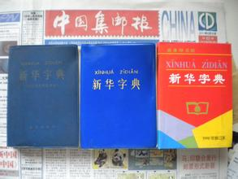

# 字典介绍

想一想：

> 如果有列表

```
nameList = ['xiaoZhang', 'xiaoWang', 'xiaoLi'];
```

> 需要对"xiaoWang"这个名字写错了，通过代码修改：

```
nameList[1] = 'xiaoxiaoWang'
```

> 如果列表的顺序发生了变化，如下

```
nameList = ['xiaoWang', 'xiaoZhang',  'xiaoLi'];
```

> 此时就需要修改下标，才能完成名字的修改

```
nameList[0] = 'xiaoxiaoWang'
```

> #### **有没有方法，既能存储多个数据，还能在访问元素的很方便就能够定位到需要的那个元素呢？**

答：

> 字典

另一个场景：

学生信息列表，每个学生信息包括学号、姓名、年龄等，如何从中找到某个学生的信息？

```
>>> studens = [[1001, "王bao强", 24], [1002, "马rong", 23], [1005, "宋x"，24], ...]
```

**循环遍历？ No！**

## <1>生活中的字典




## <2>软件开发中的字典

变量info为字典类型：

```
info = {'name':'班长', 'id':100, 'sex':'f', 'address':'地球亚洲中国北京'}
```

说明：

- 字典和列表一样，也能够存储多个数据
- 列表中找某个元素时，是根据下标进行的
- 字典中找某个元素时，是根据'名字'（就是冒号:前面的那个值，例如上面代码中的'name'、'id'、'sex'）
- 字典的每个元素由2部分组成，键:值。例如 'name':'班长' ,'name'为键，'班长'为值

## <3>根据键访问值

```
info = {'name':'班长', 'id':100, 'sex':'f', 'address':'地球亚洲中国北京'}

print(info['name'])
print(info['address'])
```

结果:

```
班长
地球亚洲中国北京
```

若访问不存在的键，则会报错：

```
>>> info['age']
Traceback (most recent call last):
  File "<stdin>", line 1, in <module>
KeyError: 'age'
```

在我们不确定字典中是否存在某个键而又想获取其值时，可以使用get方法，还可以设置默认值：

```
>>> age = info.get('age')
>>> age #'age'键不存在，所以age为None
>>> type(age)
<type 'NoneType'>
>>> age = info.get('age', 18) # 若info中不存在'age'这个键，就返回默认值18
>>> age
18
```